<div align="center">


# WAZZZZUUUUUUPPPP 🤪
### `jimiroi` • Frontend Engineer

> *"33% fluid code-driven animation sucker and 67% sixx sebeeeeennnnn"*

</div>

---

### ⚡ TL;DR

- 🏢 **Day Job:** Software Engineer at **Softinn Solutions**, building high-throughput hotel SaaS systems with **Angular (17+)**, **C#**, **.NET**, and **Razor**.
- 🎨 **Night Shift:** Solo builder crafting high-energy, tactile interactive applications with **React Native (Expo)**, **Next.js**, and **Supabase**.
- 🌀 **Animation Purist:** Obsessed with 60/120 FPS micro-interactions engineered with pure code — `react-native-reanimated`, `framer-motion`, and `@shopify/react-native-skia`.
- 🛋️ **Hardware Tinkerer:** Handcrafted custom BLE + IR controllers with **ESP32-S3** so I never have to leave the gravitational pull of the sofa.
- ⚡ **Fun Fact:** I unironically like the smell of my own fart. I stand proudly behind everything I produce. 💨
- 🏸 **IRL:** Badminton player, trail hiker, and pilot of a manual 2004 Proton Gen2.

---

### 🚀 Flagship Creations

<table>
  <tr>
    <td width="50%" valign="top">
      <h3 align="center">🎨 Wallo</h3>
      <p align="center"><b>Live Collaborative Sticker Guestbook</b></p>
      <p align="center">
        <a href="https://wallo.jimiroi.com"><b>wallo.jimiroi.com</b></a>
      </p>
      <ul>
        <li>Real-time multi-device sticker canvas synchronized via <b>Supabase Realtime</b> feeds with dual photo stickers, mystery gacha vaults, and zero-frame-drop in-tree overlays.</li>
      </ul>
      <p align="center">
        <code>React Native</code> • <code>Expo</code> • <code>TypeScript</code> • <code>Zustand</code> • <code>Supabase</code>
      </p>
    </td>
    <td width="50%" valign="top">
      <h3 align="center">💩 PiYak</h3>
      <p align="center"><b>Unhinged Gamified Health & Cycle Tracker</b></p>
      <p align="center">
        <a href="https://piyak.jimiroi.com"><b>piyak.jimiroi.com</b></a> • 
        <a href="https://github.com/NurazimRoizan/PiYak"><b>Source Code</b></a>
      </p>
      <ul>
        <li>Delightfully unhinged health tracking PWA for bowel movements & menstrual cycles featuring <b>Partner Sync (Spy Mode)</b>, 18 gamified achievements, monthly <i>Yak Wrapped</i>, and an aggressive "Toilet Boss".</li>
      </ul>
      <p align="center">
        <code>Next.js</code> • <code>Tailwind CSS</code> • <code>Prisma</code> • <code>Clerk</code> • <code>PostgreSQL</code>
      </p>
    </td>
  </tr>
  <tr>
    <td width="50%" valign="top">
      <h3 align="center">⚡ GeeyBoard</h3>
      <p align="center"><b>Couch-Potato BLE & IR Remote Controller</b></p>
      <p align="center">
        <a href="https://github.com/NurazimRoizan/GeeyBoard"><b>View on GitHub</b></a>
      </p>
      <ul>
        <li>Custom <b>ESP32-S3</b> BLE media controller + Infrared TV blaster with instant sloth-mode reconnect to navigate media and kill the TV without leaving the couch.</li>
      </ul>
      <p align="center">
        <code>ESP32-S3</code> • <code>C / C++</code> • <code>NimBLE</code> • <code>PlatformIO</code> • <code>Hardware IoT</code>
      </p>
    </td>
    <td width="50%" valign="top">
      <h3 align="center">🌐 Interactive Portfolio</h3>
      <p align="center"><b>Digital Clone & Live Telemetry</b></p>
      <p align="center">
        <a href="https://portfolio.jimiroi.com"><b>portfolio.jimiroi.com</b></a> • 
        <a href="https://github.com/NurazimRoizan/NurazimRoizan.github.io"><b>Source Code</b></a>
      </p>
      <ul>
        <li>Personal web portfolio featuring a custom inverted color engine, an embedded AI clone powered by <b>Google Gemini</b>, and live athletic telemetry dynamically synced via the <b>Strava API</b>.</li>
      </ul>
      <p align="center">
        <code>Next.js 15</code> • <code>TypeScript</code> • <code>Tailwind CSS</code> • <code>Gemini AI</code> • <code>Strava API</code>
      </p>
    </td>
  </tr>
</table>

### 📊 GitHub Activity & Telemetry

<p align="center">
  
  
</p>

**I'm a Daytime Builder ☀️**

```text
🌞 Morning          172 commits    ██████░░░░░░░░░░░░░░░░░░░    23.63 %
🌆 Daytime          483 commits    █████████████████░░░░░░░░    66.35 %
🌃 Evening           67 commits    ██░░░░░░░░░░░░░░░░░░░░░░░     9.20 %
🌙 Night              6 commits    ░░░░░░░░░░░░░░░░░░░░░░░░░     0.82 %
```

📅 **I'm Most Productive on Friday**

```text
Monday          114 commits    ████░░░░░░░░░░░░░░░░░░░░░    15.66 %
Tuesday         117 commits    ████░░░░░░░░░░░░░░░░░░░░░    16.07 %
Wednesday       114 commits    ████░░░░░░░░░░░░░░░░░░░░░    15.66 %
Thursday        164 commits    ██████░░░░░░░░░░░░░░░░░░░    22.53 %
Friday          167 commits    ██████░░░░░░░░░░░░░░░░░░░    22.94 %
Saturday          8 commits    ░░░░░░░░░░░░░░░░░░░░░░░░░     1.10 %
Sunday           44 commits    ██░░░░░░░░░░░░░░░░░░░░░░░     6.04 %
```

<p align="center">
  <a href="https://github.com/NurazimRoizan">
    
  </a>
</p>

<p align="center">
  
</p>

<p align="center">
  
</p>

<p align="center">
  
</p>

---

<div align="center">

### 💬 Let's Connect

[](https://jimiroi.com)
[](https://portfolio.jimiroi.com)
[](https://linkedin.com/in/nurazimroy)
[](mailto:rnurazim@gmail.com)

<br/>

<sub><i>"Boring, sterile corporate websites are everywhere. I don't do boring here."</i></sub>

</div>
